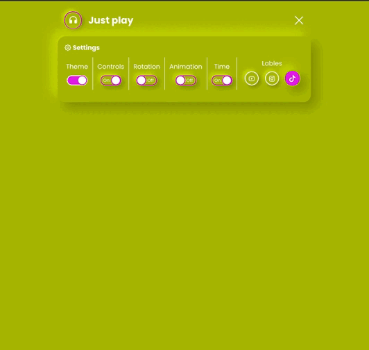

<h1 align="center"> Projeto Navbar Resposive Settings control  </h1>

  

 Projeto - Navbar para controlar configurações de player de videos podendo ativar e desativar alguma funções do player utilizando HTMl5, CSS e Javascript   

  

 

## 🚀 Tecnologias

Esse projeto foi desenvolvido com as seguintes tecnologias:

- HTML e CSS
- JavaScript
- Git e Github

## 🚀Aprendizado

Nesse projeto ultilizei  conhecimentos de HTML,CSS e Javascript essa é a primeira parte do projeto.

## 💻  Link do Projeto

- [Acesse o projeto](https://kleitonads.github.io/navBarAppVideoPlay/)

